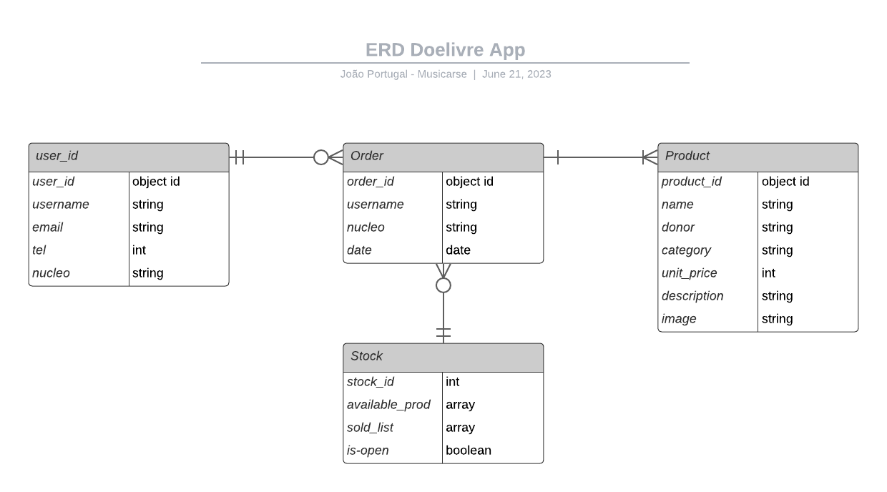

# Doelivre-api-teste

> O projeto se trata de um rascunho para construir uma API que irá gerenciar um sistema de e-commerce "colaborativo" onde os usuários podem doar produtos, e esse produtos, por sua vez, ficam disponíveis em um catálogo para que outros usuários possam comprar. O objetivo é que todo o dinheiro arrecado será revertido para ações beneficentes.

# About the Project/Sobre o projeto

- Na branch <b>main</b> está concentrado o projeto mais robusto que utiliza a biblioteca express, moongose e mongodb
- Na branch <b>http-module</b> o foco é trabalhar escrever um CRUD utilizando apenas o módulo nativo do Javascript.
- Na branch <b>express</b> é um registro do uso do express sem utilizar o banco de dados para construir APIs estáticas.

## Design inicial do Banco de Dados
> feito com Entity Relationship Diagram

  

## Requisitos para rodar o projeto

- Node.js 
- ExpressJS
- Mongoose
- MongoDB
- Nodemon

#### Setup do ambiente

- NPM

## Estrutura do projeto

> Esse projeto segue o padrão de arquitetura MVC (Model View Controller) e o modelo REST

- `./server.js`: Importa o módulo app e usa-o para iniciar o servidor para escutar numa porta especificada
- `./src`: Reune todo o arquivo fonte do projeto
    - `./app.js`: Conecta com o banco de dados e passa para a instância do express para se utilizar as rotas
    - `./config`: Configura a conexão com o banco de dados
    - `./controllers`: O controlador é um intermediário entre as requisições que vem do navegador, uma outra API, ou até mesmo o Postman.  Essa pasta reúne os controladores para todas as rotas do projeto
    - `./routes`: Reúne arquivos de definição de rotas (para definir as rotas utilizamos o express)
    - `./routes/index.js`: O arquivo index.js concentra todas as rotas que serão utilizadas na aplicação
    - `./models`: Cria as Collections e os Schemas para modelar o banco de dados utilizando o Mongoose

## Configuração
- Clone este repositório em sua máquina local usando o comando git clone https://github.com/joaosportugal/doelivre-api-teste
- Navegue até o diretório raiz do projeto: cd doelivre-api
- Instale as dependências do projeto executando npm install ou yarn install.
- Inicie o servidor de desenvolvimento executando <b>npm run dev 
- Abra o navegador e acesse http://localhost:3000 para visualizar o aplicativo.

## Contribuição
Contribuições são bem-vindas! Se você deseja contribuir para o projeto, siga as etapas abaixo:

- Faça um fork deste repositório.
- Crie uma nova branch com o nome descritivo da sua contribuição: git checkout -b minha-contribuicao.
- Faça as alterações necessárias e faça commit das suas alterações: git commit -m "Minha contribuição".
- Envie suas alterações para o repositório remoto: git push origin minha-contribuicao.
- Abra um pull request no repositório original.

## Licença
Este projeto está licenciado sob a licença MIT. Consulte o arquivo LICENSE para obter mais detalhes.

## Contato
Se você tiver alguma dúvida ou sugestão sobre o projeto, sinta-se à vontade para entrar em contato comigo por meio do email portugalestudio@gmail.com
